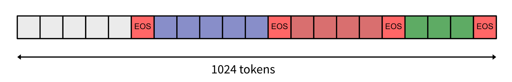

# HTML-Code-Generation
Used 4-bit precision model using bitsandbytes library and further used LoRA technique to finetune LLAMA2 for HTML code generation.
Training report can be found here
https://api.wandb.ai/links/kameng/yo4tnfhg

# LLAMA Fine-Tuning for HTML Code Generation

Fine-tune the LLAMA model for code generation tasks using the Python script. The script incorporates a range of libraries and functionalities from the Transformers library, custom model and dataset preprocessors, loss functions, and Weights & Biases (wandb) for experiment tracking.


## Features

- LLAMA model adaptation for code generation.
- Custom data preprocessing and model management.
- Loss function and GPU acceleration.
- Model validation and training functions.
- Weights & Biases integration for tracking and logging.


# Test
Trained  model is uploaded at huggingface repo at "sushant07/llama2-fine-tuned-jawerty_html_dataset"
Test API using test.py file which take two arguments
api_url and user_prompt.
Run test.py to use API endpoint as follows
```
python test.py --api_url "http://192.168.251.119:8888/query" --user_prompt "what is the rate of nissin noodles?"

```

## Dataset preparation and tokenization

The available dataset consists of HTML code paired with descriptive labels that explain the functionality or purpose of the HTML code. Size of the dataset is very small as it has only 43 datapoints and hence results might not be good it is recommended to more datapoints at least 1000 as per GPT3 fine-tuning instructions by OPEN-AI.

Here we will use "label" as a prompt to our "html" code generation we have further processed this using and converted to LLM specific prompt. This is illustrated in following example.

```
row = "this is a basic landing page with a email sign up"
prompt =
"Below is an instruction that describes a task."
"You will be provided a prompt and based on it you have to generate HTML code. Write a response that appropriately completes the    request.\n\n" "### Instruction:\n{}\n\n### Response:\n").format(row)

```


To make training more efficient and use the longer context of these LLMs we'll use something called "packing". We will combine multiple examples to fill the model's memory and make training more efficient instead of feeding examples individually. This way we avoid doing a lot of padding and dealing with different lengths.


*Image source: [Link to Image Source](https://api.wandb.ai/files/capecape/images/projects/38233410/d9f4c0c2.png)*

We concatenate(pack) different datapoints seperated by EOS token[</s>]

Further we will use PyTorch DataLoader to load data in batches for training.

## Model Configuration
We will load a 4-Bit Quantized model using the BitsAndBytesConfig configuration to make it compatible with Colab. Additionally, we will incorporate a LoRA adapter for fine-tuning, configuring it with a rank of 16 and a scaling parameter of 64. To achieve this, we will identify all linear layers and encapsulate them within modules, then apply the LoRA adapter using the `create_peft_config` function from the PEFT library.

Furthermore, we intend to optimize the training process by employing an 8-Bit Adam optimizer, which will result in faster training steps. As for the loss function, we will utilize flat cross-entropy.


## Training

In accordance with the assignment's requirements, we opted for PyTorch training instead of using the SFTTrainer function from the TRL library. This approach grants us greater control over the training process and facilitates a deeper understanding of LoRA fine-tuning.

In this training phase, we adopted mixed precision training through the utilization of `torch.amp.autocast`. This technique enables the concurrent use of both `float32` and `float16` bit data types. The rationale behind this choice lies in the fact that certain operations, such as linear layers and convolutions, are computationally more efficient in lower precision. Conversely, some operations, such as reductions, often necessitate the wider dynamic range offered by `float32`. Mixed precision aims to match each operation with its appropriate data type, thus ensuring stability in the training process.

Additionally, we employed gradient accumulation over 4 steps before updating the model parameters. This approach not only optimizes memory usage but also contributes to the overall training efficiency.

As specified in the assignment instead using SFTTrainer function from TRL library we have used PyTorch traning to have more control under the hood. This has enabled me to get better understading of LoRA finetuning. 
Here I have used mixed precision trainig using torch.amp.autocast. which enables us to use both `float32` and `float16` bit datatype. This is because some operations are faster in lower precision such as  linear layers and convolutions etc.  Other ops, like reductions, often require the dynamic range of `float32`. Mixed precision tries to match each op to its appropriate datatype. This is more stable appraoch than using model.half() which enables entire training in lower precision. We are accumulating gradient over 4 steps then updating parameters this also saves us some memory.

## Evaluation
We have use rouge score and accuracy metrics to measure the performance which is logged at this link
[https://api.wandb.ai/links/kameng/yo4tnfhg](https://api.wandb.ai/links/kameng/yo4tnfhg)

## Requirements

- Python 3.x
- PyTorch
- Transformers
- bitsandbytes
- wandb
- tqdm

Ensure all dependencies are installed using the requirements file or individually.

## Configuration and Usage

1. **Setting Up**: Define your configuration in the `setup_config()` method. Adjust parameters like learning rate, epochs, and batch size according to your needs.

2. **Preprocessing Data**: Utilize the `DatasetPreprocessor` to handle your data needs. Ensure you have a suitable dataset and adjust the `dataset_id` accordingly.

3. **Model Initialization**: The script uses the "meta-llama/Llama-2-7b-hf" model. Initialize and manage the model using the `ModelManager`.

4. **Training**: Run the `train_model` function, providing it with the model, data loaders, optimizer, scheduler, and config.

5. **Validation and Evaluation**: Validate model performance using the `validate` function and further analyze using predictions and rouge scores.

6. **Model Saving and Logging**: The script saves the model and tokenizer using `save_model` and logs the training process to wandb.

## Customizing the Script

- **Model and Data**: Change the `model_id` and `dataset_id` to use different models or datasets.
- **ModelManager and DatasetPreprocessor**: Adjust these classes as needed for different model configurations or data preprocessing steps.

## Running the Script

To execute the script, run:

```bash
python [script_name].py
